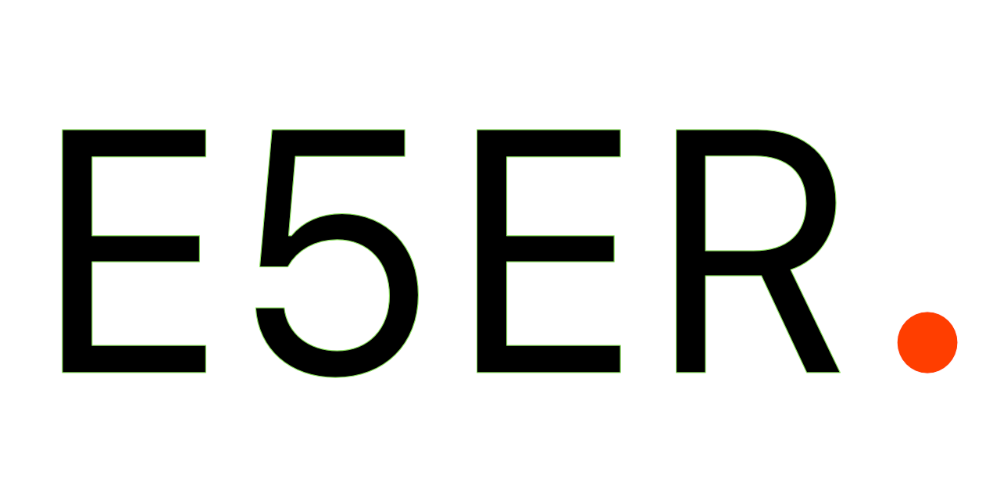

  

# E 5 E R .

> CODE . DATA . DESIGN .

---

### Key Idea
**E5ER.** is more than a name; it functions as a **Method Call**. In the world of software, the dot (`.`) represents the point where an object transitions into action.

### Technical Specifications
* **Root:** Anil ESER
* **Variable:** 5 (The Digital Synthesis)
* **Operator:** `.` (The Execution Point)

### Tech Stack & Interests
* **OS:** macOS (Primary Operator)
* **Focus:** Data Science, Code Architecture, Creative Design.

---

### [ ACCESS PASS . ](https://anil-eser.github.io/e5er/)
*UNIFIED CONTACT LINKS FOR ANIL ESER*

---
*© 2026 E5ER. All methods executed.*